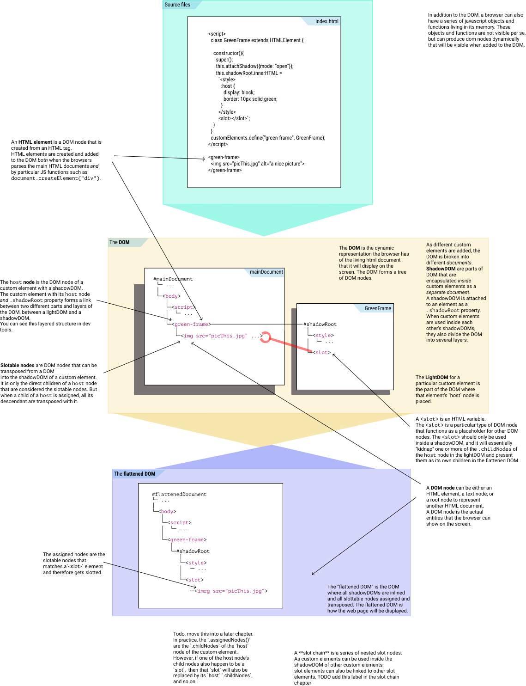

# WhatIs: `<SLOT>`
                                                                   
To **"compose HTML"** is to put HTML elements a) next to each other, b) nested inside each other's 
lightDOM and c) nested inside each other's shadowDOM.

When you put HTML elements **next to each other**, 
they will be presented as beads on a string. You may of course use CSS to 
style the look of this string: make it go top-down, bottom-up, left-to-right, right-to-left, 
only show the first five elements, etc. But, regardless of the style of the string of elements, 
the beads you put on it is one after the other, sequential.

When you nest HTML elements inside *only* each other's lightDOM *or* shadowDOM, 
they will be presented as frames-within-frames or boxes-within-boxes.
You may of course use CSS to style the look these boxes: some boxes may be contained within each 
other as frames and passe partout around a picture; other boxes may be be skewed, the inner box 
overflow the borders of the outer box; or the inner and outer boxes may stretch or pull to make 
each other fit. Regardless, as long as you only nest elements in *either* the lightDOM *or* the 
shadowDOM, they are simply boxes-within-boxes.

But, what if you nest HTML elements *both* in each other's lightDOM *and* shadowDOM?

## `<slot>` merges lightDOM elements into the shadowDOM 

When you nest HTML elements inside each other in *both* the shadowDOM *and* the lightDOM, 
you have a problem. You have a *two*-dimensional boxes-within-boxes structure.
And the browser/HTML can only display *one* uniform boxes-within-boxes structure on screen.
So, how do you unify the boxes-within-boxes structure from the lightDOM with the
boxes-within-boxes structure from the shadowDOM? 
                                            
The most simple and immediate answer is: you don't. You choose one. And in HTML, the shadowDOM is
chosen and nested lightDOM elements are kicked to the curve. (That is, when you have nested elements 
in *two* dimension, both shadowDOM and lightDOM.)

But. There is *one* way to merge elements from the lightDOM into the shadowDOM. 
If you place a `<slot>` element inside the shadowDOM of an element, then that `<slot>` element
will "pick up" the lightDOM children elements that was suppressed, and place them in the hierarchy of
the shadowDOM. The `<slot>` element reserves a space for the lightDOM elements in the unified
boxes-within-boxes structure of the shadowDOM. This way of symbolically moving elements from the lightDOM
into the shadowDOM is called to "transpose" elements.

## Many `<slot>` elements with many transposed elements

A shadowDOM can both:
1. contain several `<slot>` elements and 
2. fill several lightDOM elements into a single `<slot>`.

To use several different `<slot>` elements to host different types of lightDOM elements is fairly
straight forward. [`name` and `slot` attributes](4_WhatIs_slotname) are added on the `<slot>` and 
transposed elements respectively, and then matched as the nested structures are merged.

Similarly, several lightDOM elements can be transposed into a single `<slot>` element. 
This one-to-many relationship between `<slot>` and transposed nodes gives the shadowDOM the 
flexibility it needs to capture and encapsulate lightDOM elements.

## Example: `<green-frame>` with `<slot>`

In this example we create a simple web component with a `<SLOT>`. 
The web component called `GreenFrame` has a single slot, and
it will stretch to fit that slot and 
add a 10px wide green border around it.

```html
<script>
  class GreenFrame extends HTMLElement {       
    
    constructor(){
      super();
      this.attachShadow({mode: "open"});     //[1]
      this.shadowRoot.innerHTML =             
        `<style>
          div {
            display: block;                                  
            border: 10px solid green;
          }
        </style>

        <div>
          <slot></slot>
        </div>`;
    }
  }
  customElements.define("green-frame", GreenFrame);
</script>

<green-frame>                                                <!--3-->
            <!--4-->
</green-frame>
```

Below is a diagram that illustrates how this all fits together:



## What happened?

1. The browser loads the source file `index.html`.
2. The browser's parser starts to parse the `index.html` file and build the `main` html document from that file.
3. As the parser encounters the `<script>`, it runs it, and from it creates a definition 
for the `GreenFrame` web component which it registers under tag name `<green-frame>`.
4. When the browser then encounters the `<green-frame>` tag in the document,
it creates a new html document for that element.
   1. The `this.attachShadow({mode: "open"});` creates the inner document. 
   2. The root of this new html document is placed under the `.shadowRoot` 
      property of its `<green-frame>` element node in the `main` html document. 
      This node is referred to as this web component instance's `host` node.
   3. The parser will then create the inner document content using the text passed into 
      `this.shadowRoot.innerHTML`.
   4. Inside the inner document of the `<green-frame>` component, 
      there is a separate `<style>` for that document, and a `<div>` 
      that wraps around the `<slot>`.
5. When the browser is finished running all its processes to make the two documents, 
   the `main` document and the inner document of the `<green-frame>` host node, 
   it will convert this *multi-document* **DOM** into a single document **flattened DOM**.
6. The browser will then finally render it, by ascribing style to the nodes in this 
   **flattened DOM**, calculating these nodes layout, and then paint them.
   
 * To transpose a large document full of slotable nodes sound computationally very heavy. 
   But, in practice, it rarely is. The browser can easily keep track of which slotable nodes have been changed, 
   and which remain the same as before. It then only works on the changes, leaving the rest untouched.
   By working "smart" like this, the browser can keep the flattened DOM up-to-date, always, 
   with little to no effort.

## References
 * [HTML spec: `<slot>`](https://html.spec.whatwg.org/multipage/scripting.html#the-slot-element)
 * [HTML spec: assigning slotables](https://dom.spec.whatwg.org/#shadow-trees)
 * [Google: lightDOM](https://developers.google.com/web/fundamentals/web-components/shadowdom#lightdom)
