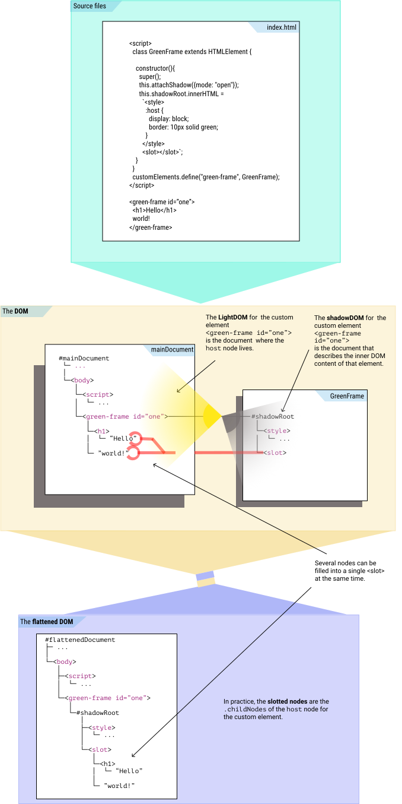

# WhatIs: shadowDOM and `<SLOT>`



Several nodes can be added to the same <slot>.

* **ShadowDOM** are pieces of DOM that are encapsulated *inside* custom elements as a *separate document*.
A shadowDOM is attached to an element as a `.shadowRoot` property.
As different custom elements are added, the DOM is broken into different parts, different shadowDOMs.
When custom elements are used inside each other's shadowDOMs, 
they also divide the DOM into several layers.

* The **LightDOM** for a particular custom element is the part of the DOM where 
that element's `host` node is placed.

* The **`host` node** is the DOM node of a custom element with a shadowDOM.
The custom element with its `host` node *and* `.shadowRoot` property forms a link
between two different parts and layers of the DOM, between a lightDOM and a shadowDOM.
You can see this layered structure in dev tools.

* A **`<slot>`** is an HTML variable. 
The `<slot>` is a particular type of DOM node that functions as a placeholder for other DOM nodes.
The `<slot>` should only be used inside a shadowDOM, and 
it will essentially "kidnap" one or more of the `.childNodes` of the `host` node in the lightDOM and 
present them as its own children in the "flattened DOM".

* **assignable nodes** are DOM nodes that can be transposed from a DOM 
into the shadowDOM of a custom element.
It is only the direct children of a `host` node that are assignable.
But when a child of a host is assigned, all its descendant are transposed with it.

* A **slot chain** is a series of nested slot nodes.
As custom elements can be used inside the shadowDOM of other custom elements,
slot elements can also be linked to other slot elements. 

* **`.assignedNodes()`** are the set of actual nodes that one `<slot>` element will transpose.
In practice, the `.assignedNodes()` are the `.childNodes` of the `host` node of the custom element.
However, if one of the host node's child nodes also happen to be a `slot`, 
then that `slot` will also be replaced by its `host` `.childNodes`, and so on.

* The **flattened DOM** is the DOM where all `host` nodes are resolved, 
all the assignedNodes are transposed into their shadowDOM positions and 
the lightDOM and shadowDOM are "flattened" as they will be displayed.

## Example: GreenFrame
In this example we create a simple custom element with a shadowDOM. 
The custom element called GreenFrame will add a green border 10px wide around its content.

```html
<script>
  class GreenFrame extends HTMLElement {       
    
    constructor(){
      super();
      this.attachShadow({mode: "open"});     //[1]
      this.shadowRoot.innerHTML =             
        `<style>
          :host {
            display: block;                                  
            border: 10px solid green;
          }
        </style>
        <slot></slot>`;                      //[2]  //[5]
    }
  }
  customElements.define("green-frame", GreenFrame);
</script>

<green-frame>                                                <!--3-->
            <!--4-->
</green-frame>
```
1. A `.shadowRoot` is added to the custom element.
2. A `<slot>` element is added in this shadowDOM.
3. A `<green-frame>` host node is created in an HTML document.
The document in which this `host` node exists is the lightDOM 
for the `<green-frame>` custom elements.
4. An `` element is added as child node for the `<green-frame>` host element.
As a direct child of the host node, 
the `` node is an *assignable* node for the `<green-frame>` custom element.
5. The `<slot>` element is assigned to ``.
`.assignedNodes()` on this slot element will return a list with `[textNode, , textNode]`
(the textNodes are the new-line and whitespace characters around the `` element).

We can imagine the flattened DOM looking something like this:
```html
<green-frame>                                                <!--1-->
  <style>                                                    <!--2-->
    __special_selector__ {                                   <!--3-->
      display: block;                                  
      border: 10px solid green;
    }
  </style>
  <slot>
              <!--4-->
  </slot>
</green-frame>
```
1. The `<green-frame>` host node still exists
2. `<style>` element from the shadowDOM is pulled up into the lightDOM.
3. We can imagine the browser creating a `__special_selector__` CSS selector 
that only applies to this particular branch of the DOM, 
starting from the parent node of this particular style node.
No such node-specific rules exists in normal CSS.
4. First, the `<slot>` node is replaced by its `.assignedNodes()`.
Then these `.assignedNodes()` are pulled up into the lightDOM like the `<style>` element.

## References
 * https://developers.google.com/web/fundamentals/web-components/shadowdom#lightdom