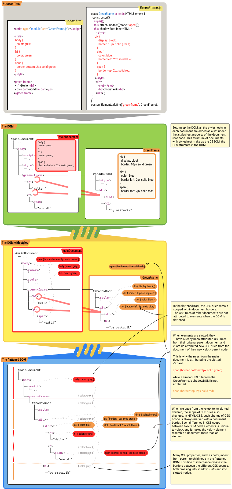

# HowTo: style `slot`

Both `<slot>` nodes themselves and their slotted nodes are first and foremost 
**styled normally in their respective lightDOM context**.
When you in a (lightDOM) document place a node as a slotable node under another custom element, 
ie. as a child of a custom element's host node, then that slotable node is 
first and foremost styled regularly with the CSS rules from that (lightDOM) document.
When you add a `<slot>` node to a custom element's shadowDOM document,
then that shadowDOM document is the lightDOM document around that `<slot>` node, and
that `<slot>` node would be styled with the regular CSS rules that applies to it from that document.

Let me put it another way. Please, let me go on explaining and preeeeeaching about the beeeautiful 
principles of styling `<slot>`s.
Let me do that because you and I, we both believe that *talking* about styling `<slot>`s will make it 
understandable.
Or maybe not. Maybe styling `<slot>`s is easier done than said.
Let's try with an example and diagram instead:

## Example: `<green-frame>` with style

In this example we add some CSS rules to the green frame.
Here we only attempt to illustrate how the CSS rules work, *not* style itself.

```html
<script>
  class GreenFrame extends HTMLElement {
    constructor() {
      super();
      this.attachShadow({
        mode: "open"
      }); //[1]
      this.shadowRoot.innerHTML =
       `<style>
          div {
            display: block;
            border: 10px solid green;
            color: skyblue;
          }
          slot {
            color: blue;
            border-left: 2px solid blue;
          }
          span {
            border-top: 2px solid red;
          } 
        </style>

        <div>
          <slot></slot>
          <h2>by orstavik</h2>
        </div>`;
    }
  }
  customElements.define("green-frame", GreenFrame);
</script>
<style>
  body {
    color: grey;
  }

  h1 {
    color: green;
  }

  span {
    border-bottom: 2px solid green;
  }
</style>
<green-frame>
  <h1>Hello </h1>
  <p><span>world!</span></p>
</green-frame>
```

### Diagram


Right click and open image in new tab for a better view.

## What happened?

When the browser creates the DOM, it will parse the content of all `<style>` and 
`<link rel="stylesheet">` elements and set up `stylesheet` objects on the document root node. 
These `stylesheet` objects form the basis of the CSSOM.

*Before* the DOM is flattened, the CSSOM rules are merged into the DOM hierarchy. 
At this point, the documents in the DOM still remain separate, and 
this means that the rules in the CSSOM `stylesheet` objects are matched to the
nodes *within each document*. 

*Then* the DOM is flattened. To flatten the DOM thus means to move/transpose nodes:
 * **with individually attributed CSS rules**
 * **from the host** node parent in the lightDOM
 * **to the slot** node parent inside the shadowDOM.

*After* the DOM is flattened, **inherited** CSS property values gets attributed to each node.
The inherited value of CSS properties thus follow the *flattened* hierarchy of the DOM working
*across DOM document borders*.

*As a result* in the flattened DOM, we see that:
1. **CSS rules** are *only* attributed **within document borders, before documents are flattened** while
2. **CSS inheritance** is done **across document borders, after documents are flattened**.

With regular CSS selectors, this gives us 4 ways to style `<slot>` and slotted nodes:

1. The `<slot>` element itself can be directly attributed CSS rules from its document (shadowDOM). 
2. The `<slot>` element can inherit styles from its parents nodes in its document (shadowDOM).
3. The slotted nodes can be directly attributed CSS rules from their document (lightDOM).¸and
4. The `<slot>` and slotted nodes can both inherit CSS properties from the host node and all its ascendants
in the lightDOM as inheritable CSS properties are not stopped by document borders.

## For chapter on style creep

There is a strange thing about the `<slot>` element as an HTML variable.
As mentioned before, `<slot>` elements are not resolved, but filled with content.
This means that in the flattened DOM, the `<slot>` element still exist. 
And this means that the `<slot>` itself *can be styled*.
 
## References
 * dunno