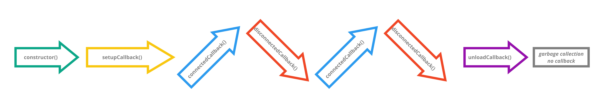

# Introduction: custom element lifecycle

> TLDR: Custom elements are:
> 1. created once (`constructor()`)
> 2. setup once (`setupCallback()`)
> 3. connected/disconnected to the DOM sequentially
>    1. `connectedCallback()`
>    2. `disconnectedCallback()`
> 5. unloaded once (`unloadedCallback()`)
> 6. deleted once (no callback)



## Native lifecycle callbacks

The **lifecycle** of custom elements (ie. `HTMLElement` subclasses) has a fixed pattern.
**Lifecycle callbacks** (also known as "lifecycle hooks") are methods on the element 
that are triggered at various points during the lifecycle.

Some **lifecycle callbacks** already exist on the `HTMLElement` class:
* `constructor()`
* `connectedCallback()`
* `disconnectedCallback()`

We call them **native lifecycle callbacks**.
Native lifecycle callbacks are triggered by the browser (or polyfill) and just work.
But! There are several contextual limitations and best practices in how and when 
to use the native lifecycle callbacks. We discuss these practices in later chapters
[How to overrided `constructor()`](HowTo_constructor.md) and 
[Problem: attributes in `constructor()`](Problem1_attributesInConstructor.md).

## Custom lifecycle callbacks

Two important moments in the life of a custom element has no corresponding native lifecycle callback:
1. when to setup the element
2. when the browser or tab is closed (the `unload` event)

However, we can create lifecycle callbacks for these moments using either a mixin or code snippet.
We call them **custom lifecycle callbacks**:
1. `setupCallback()`
2. `unloadCallback()`

### `setupCallback()`

To set up a simple **`setupCallback()`** can be done in this single(!) line of code added 
at the *very* beginning of `connectedCallback()`:
```javascript
connectedCallback(){
  this.isSetup || ((this.isSetup = true) && this.setupCallback());
  super.connectedCallback();
  //do your other stuff here
}
```

However. By taking control of the timing of an element's setup, setup of elements can both be *delayed* 
and done *in advance*. By *delaying* setup of non-critical elements, an app can increase the performance of 
critical elements at times when the browser is low on resources (f.x. when the page is loaded).
By setting up elements *in advance*, an app can increase its performance at a later critical moment when
for example UI interaction is taxing the browser's resources hard.
When the `setupCallback()` is either delayed or done in advance, the triggering mechanism 
of the callback method becomes both more complex and resource intensive.
In such cases the use of a mixin to trigger `setupCallback()` is strongly recommended.

`setupCallback()` is described more in detail in the following chapters:
* [Problem: when to setup elements](Problem2_setupElement.md)
* [Setup: immediately](todo)
* [Setup: delay](todo)
* [Setup: in advance](todo)

### `unloadCallback()`

The **`unloadCallback()`** is simple and rarely needed. 
Its main purpose is to create a destructor that ensures that the app for example 
a) disconnects database connections and/or 
b) logs out users when the user abruptly closes the tab or browser.
The `unloadCallback()` can be created by adding a code snippet 
with an event listener for the `unload` event in the `constructor()` or `setupCallback()`.
Using a code snippet is suitable when you have only a single or a few elements 
that need to ensure proper destruction.
If many elements need to ensure proper destruction, then [`UnloadMixin`](todo.md) is needed.

## References

