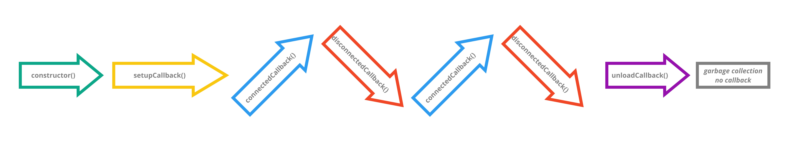

# Introduction: custom element lifecycle

> TLDR: Custom elements are:
> 1. created once (`constructor()`)
> 2. setup once (`setupCallback()`)
> 3. connected/disconnected to the DOM sequentially
>    1. `connectedCallback()`
>    2. `disconnectedCallback()`
> 
> Att! `unload` does not trigger `disconnectedCallback()` automatically.

## Native lifecycle callbacks

The **lifecycle** of custom elements (ie. `HTMLElement` subclasses) has a fixed pattern.
**Lifecycle callbacks** (also known as "lifecycle hooks") are methods on the element 
that are triggered at various points during the lifecycle.

Some **lifecycle callbacks** already exist on the `HTMLElement` class:
* `constructor()`
* `connectedCallback()`
* `disconnectedCallback()`

We call them **native** lifecycle callbacks, and they are triggered automatically by the browser/polyfill.

But. There are a couple of contextual limitations for how and when native lifecycle 
callbacks can be used ([Problem: attributes in `constructor()`](Problem1_attributesInConstructor.md)).
These limitations leaves two crucial moments in the custom element lifecycle with no corresponding 
native callback:
1. when the element is ready to set up
   (*once after* attributes has been set and *before* the first `connectedCallback()`
2. when the browser or tab is closed 
   (the `unload` event)

To address these two moments we need to add some additional resources to the custom element:
1. `setupCallback()`, a custom life cycle callback.
   You can read more about `setupCallback()` in:
   * [Problem: when to setup elements](Problem2_setupElement.md)
   * [Mixin: setup](Mixin_setup.md)
   * [Pattern: setup in advance](Pattern1_setup_in_advance.md)
   * [Pattern: delay setup](Pattern2_delay_setup.md)
2. `UnloadDisconnectsMixin`, a mixin that ensures that if the user closes the browser or tab, 
   `disconnectedCallback()` is triggered. 
   See [Mixin: UnloadDisconnects](Mixin_unload_disconnects.md).

To properly understand this lifecycle, I recommend that you start with the problems
[Problem: attributes in `constructor()`](Problem1_attributesInConstructor.md) and
[Problem: when to setup an element](Problem2_setupElement.md).
Then look at the different patterns for invoking `setupCallback()` and 
then finally see `UnloadDisconnects`, the simplest of them all.

## References

