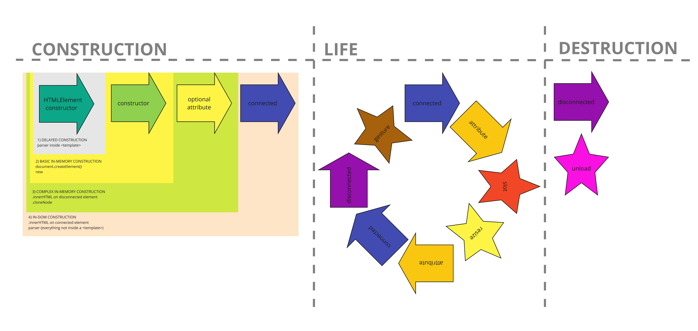
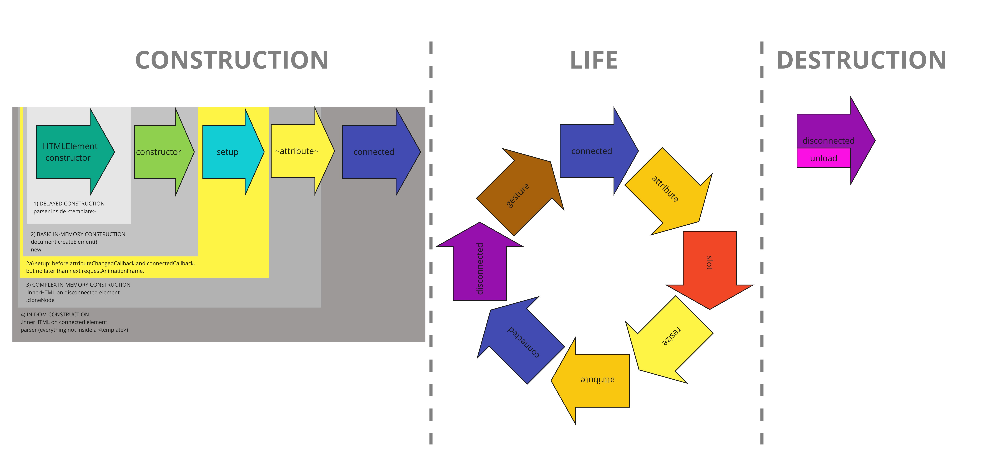

# Intro: wc lifecycle

> TLDR: First, WC are setup using the `constructor()`.
> To delay setup of WC (and native HTML elements), use `<template>`.
> Native callbacks can be called irregularly.
> `unload` does not trigger `disconnectedCallback()` automatically.



## `constructor()`

The `constructor()` is the first lifecycle callback of a custom element.
It is called when the element is first created.
In the `constructor()` you must first call `super()`, and 
then you can set up and populate a shadowDOM and create event listener objects.
For efficiency, regular JS properties on the custom element should also be initialized in the constructor.
Below is an example of a custom element `constructor()`:

```
constructor(){
  super();
  this.attachShadow({mode: "open"});
  this.shadowRoot.innerHTML = "<h1>I'm setup in the constructor.</h1>";
  this._reuseableEventListener = (e) => this.myEventFunction(e);
  this.aDataProperty = null;
}
```

There are two issues are concerning the custom element `constructor()`:
1. Initial HTML attributes cannot be safely read nor set in the `constructor()`.
This is solved using the [Pattern: .initialAttributesCallback](todo).
2. When custom elements are added under a `<template>` element, then *only* 
the HTMLElement's constructor() is triggered, and 
the custom elements own constructor and setup is delayed until connected.
This can be used to delay the construction of elements with the [Pattern: temporaryTemplate](todo).

## native callbacks

Some **callbacks** already exist on the `HTMLElement` class. 
These callbacks are triggered synchronously when they occur, ie. irregularly.
The most important are:
* `attributeChangedCallback()`
* `connectedCallback()`
* `disconnectedCallback()`

When constructing elements via the HTML parser, there is one important issue with the native callbacks.
The HTML parser in the browser automatically creates elements when it parses the main HTML document or 
when it is invoked using `.innerHTML`.
If the element being parsed contains one or more (observed) html attributes,
then the parser must also trigger one or more `attributeChangedCallback()`s.
(`.cloneNode` will also automatically trigger `attributeChangedCallback()` if necessary.)
The parser must also connect the elements to the DOM, thus automatically triggering `connectedCallback()`
(unless `.innerHTML` is performed on a disconnected element).
In practice, this means that there is no fixed sequence of these three callbacks 
when constructing an element, and that you as a developer must anticipate that
the browser will automatically trigger any one of these callback combinations when constructing an element:
 * `constructor()`
 * `constructor()` + `connectedCallback()`
 * `constructor()` + `attributeChangedCallback()`
 * `constructor()` + `attributeChangedCallback()` + `connectedCallback()`

## end of life

To delete and remove an elements and all its components from the browsers memory,
the element must be disconnected from the DOM and all strong object references to the element must be removed.
This will trigger `disconnectedCallback()`.
However, when the browser "unloads", the browser does not trigger `disconnectedCallback()`.
The `unload` event is triggered when the browser itself or a tab or iframe in the browser is closed.
The [Mixin: UnloadDisconnects](todo);




## References

