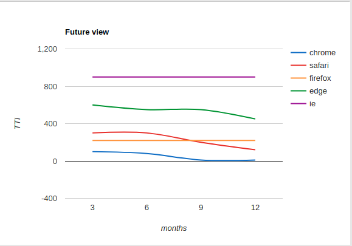

# Pattern: PolyfillLoaderGenerator

Ok, we have the full polyfill-loader. It is nice.
We can add it as a link to our page, or we can inline it.
But. There is one problem. 
Being so flexible, it is also a bit big!
I wan't to run this synchronously, and 
then I don't want that many bytes to neither load nor run.
Also, I have different apps that need different polyfills. 
I don't want to neither hand-write nor maintain the polyfills.

The solution is the PolyfillGenerator.
You tell the PolyfillGenerator which polyfills you need, and 
the PolyfillGenerator creates a short snippet of JS code that 
you can inline in your html-entrypoint file (index.html).
This code contains a custom micro-framework that:
 * does FeatureDetection for the polyfill you need,
 * loads the polyfill async or sync depending on your specification,
 * patches the polyfill if needed,
 * adds a small `window.polyfill` framework needed that includes 
 the `polyfill.ready()` facility if you want it, and 
 * adds triggers for when you want to run `polyfill.ready()`.

You can use the following [PolyfillLoaderGenerator codepen]().

## Browser/polyfill profiling

The polyfill generator should also include data about browsers, their use, and their feature support.
This data can be crossed with the selection of polyfills features.
This will give an estimate of polyfill-transfer size time to load for different browsers.
If this data is then combined with an estimate on TOA for different features in the browsers,
this could provide a potentially very useful diagram for the cost of polyfilling for the current
feature selection.
```javascript
combination   %use  files size   time   browsers
**********************************************************
no polyfills  58%   0      0kb    2ms   Chrome 55+, Safari 11.1+
WC            12%   1    120kb   82ms   Firefox 49+, Chrome 53-55
WA            10%   1    130kb   85ms   Safari 10.1-11.1
WC-WA         20%   2    250kb   95ms   Safari 9-, firefox 48-, Edge, IE
================================================================
average           0.6     13kb   40ms
```

Very rough example of future statics tool.
